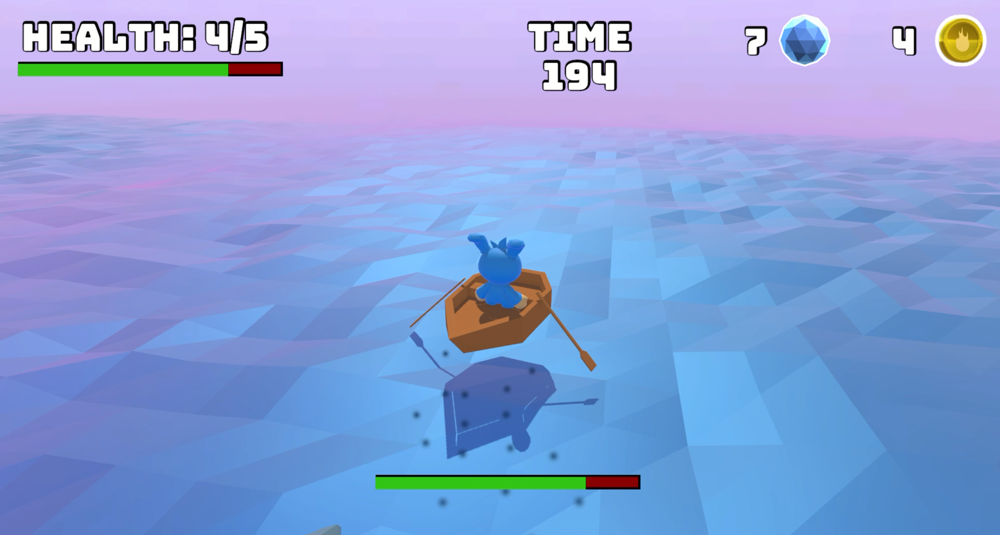
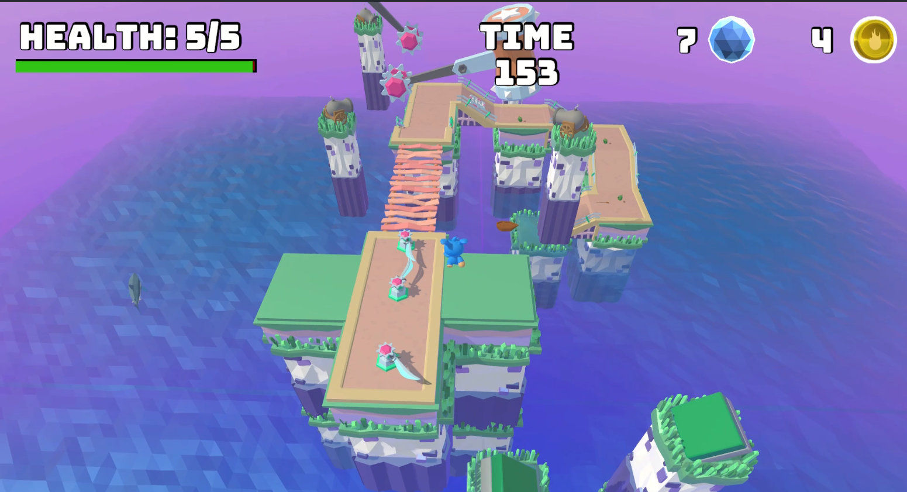
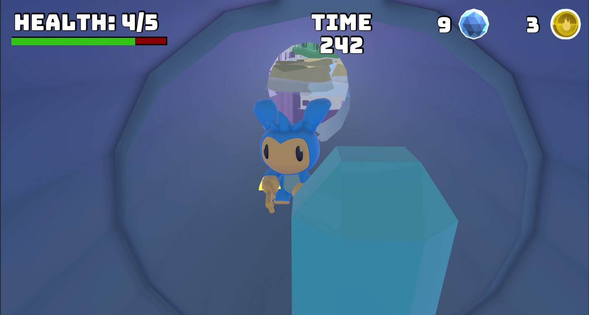
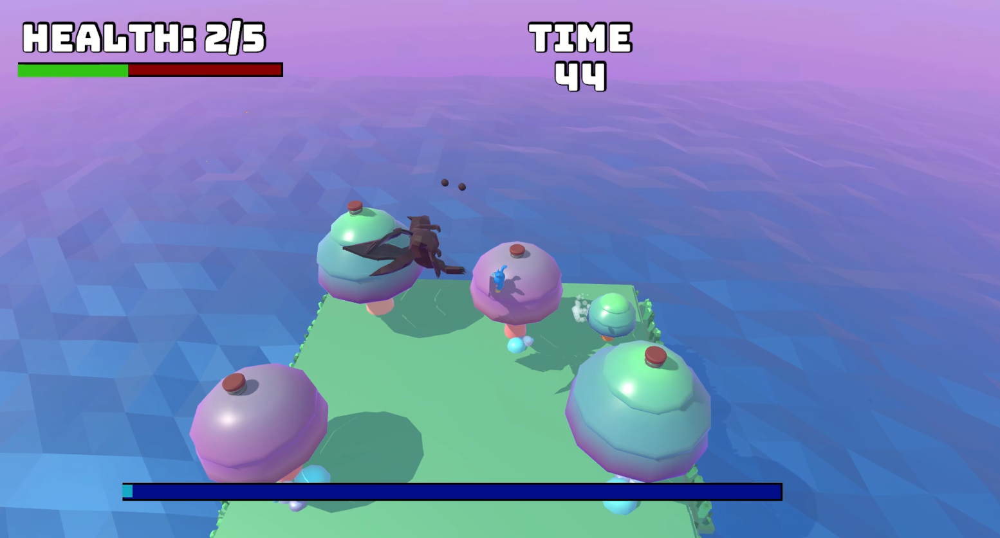

# 🎮 Rescue Hop

**Rescue Hop** is a single-player, narrative-driven **3D platformer** developed with **Unity**.  
The game blends classic precision platforming with physics-based vehicle traversal and tool-based mechanics.

> **“Hop beyond the horizon, save the lost friend!”**

**Developer:** Enes Demir  
**Engine:** Unity (URP)  
**Platform:** PC  
**Genre:** 3D Action-Adventure / Platformer  
**Playtime:** ~20–30 minutes (polished vertical slice)

---

## 📸 Screenshots

---

## 🧩 Game Overview

Rescue Hop follows a linear, hub-based progression where the player explores a fantasy archipelago to rescue a lost friend.  
Gameplay begins with a cinematic introduction, continues through multiple themed regions connected via a central hub, and culminates in a multi-stage boss fight followed by a scripted ending.

The core focus of the game is **traversal** — mastering movement, timing, and environmental interaction rather than traditional combat.

---

## 🎯 Gameplay Philosophy

### Gameplay Variety
The game gradually introduces new movement systems:
- On-foot precision platforming
- Physics-based boat traversal
- Tool-based platform creation using the Bubble Gun

This ensures the player is constantly engaging with the world in new ways.

### Progression System
Progression is controlled via a **Hub World**:
- Coins are collected during gameplay
- Every **5 Coins → 1 Crystal**
- Crystals unlock new areas and the final boss bridge

### Narrative Context
The mechanics are tightly tied to the narrative:
- Intro cinematic establishes motivation
- Gameplay supports the journey
- Ending cutscene provides closure

---

## 🌍 The Game World

The game takes place in the **Sunstone Archipelago**, a collection of floating islands and ocean zones.

### Key Areas
- **The Hub** – Central level selection and progression tracking
- **Sunstone Shore** – Classic platforming with ruins
- **The Sunken Key** – Open-water traversal using a boat
- **Bubble Bop Heights** – Vertical boss arena focused on tool-based traversal

---

## 🕹️ Controls & Mechanics

### Movement
- **On Land:** Run & jump-based platforming
- **At Sea:** Physics-based boat controls (thrust & steering)
- **Combat/Tools:** Aiming and firing the Bubble Gun

### Tools
- **Bubble Gun:** Creates temporary floating platforms
- **Paddle:** Required to operate the boat

---

## 🤖 Enemies & AI

- **Sharks:** Patrol and chase behavior using a state machine
- **Dragon (Boss):** Multi-phase AI with aerial attacks and vulnerability phases

All AI behaviors are implemented using custom **State Machines**.

---

## 🎥 Camera System

- Third-person follow camera with collision handling
- Context-sensitive framing for boss fights
- Scripted cinematic cameras for story moments

---

## 🎨 Visuals & Rendering

- **Rendering Pipeline:** Unity Universal Render Pipeline (URP)
- **Style:** Low-poly, toon-inspired, dreamy aesthetic
- **Lighting:** Real-time lighting with fog and color grading per level
- **Shaders:** URP/Lit & Simple Lit with rim lighting for character clarity

---

## 🔊 Audio & Music

- Adaptive background music per gameplay context
- Spatial 3D audio using Unity AudioSource
- Distinct sound cues for movement, interaction, and boss attacks

---

## 💾 Saving & Persistence

The game uses an automatic save system based on **PlayerPrefs**:
- Coins & Crystals
- Unlocked levels
- Last visited location
- Continue / New Game state

---

## 🧪 Technical Features

- Modular C# architecture
- Scene-based level management
- Physics-based water & buoyancy
- Centralized managers (GameManager, LevelManager, AudioManager)
- Prefab-driven workflow for all interactive objects

---

## 🚫 Multiplayer

Rescue Hop is a **single-player-only** experience.  
No multiplayer, online services, or internet connection required.

---

## 🏁 Victory Condition

The game is completed when:
1. The Dragon is defeated
2. The ending cinematic is triggered
3. The final “THE END” screen is reached

---

## 🚀 Future Ideas (Not Implemented)

- Time Attack Mode (speedrun-focused)
- Cosmetic-only character customization
- Replay-focused challenges

---

## 📜 License

This project was developed as a **student project / portfolio piece**.  
All assets are used for educational purposes.
